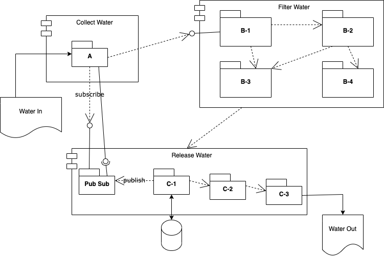

# Component Diagrams
A component diagram is a useful high level design diagram showing high level components and their dependencies.
This type of diagram is very useful to describe how code is organized into components and how to break up large
projects into smaller components. This type of diagram is useful to communicate with team members this composition
and to have a shared understanding of the dependencies between components. 

Without such a diagram code will normally evolve into a spaghetti code of dependencies.

With such a diagram the dependencies in the diagram can provide constraints about what code is allowed to call what code
and the team can control and limit the dependencies and prevent code from evolving into a mess.

# Start With Existing System
Often in a project we are starting from an existing system. It is always a good idea to create a diagram of the existing system first.
Finly knows little about the Dam project of Ben the Beaver so his initial component diagram might look like this.

This is very simple, but at least shows the external inputs and outputs of the system. This is a better overview than
just looking at directories of source code.

# Adding More Detail
The next thing that Finly tries is to look at the existing source code and try create sub-components to represent collections of code.
He is still just trying to describe the existing system so his next version of a component diagram might look like this.

At this point our component diagram is showing a lot of information. 
The subcomponent boxes represent either files or packages (directories of files) of the source code.
The arrows show when code in one box calls or makes reference to code in another box.

It appears that the code is a giant mess of spaghetti code.
Left to evolve you can imagine that new developers will add new code and new dependencies. Without any rules to know what 
is allowed to call what this will get more and more complex and harder to understand. However, this diagram makes visible
at high level some organization in the existing code. This diagram can be used in discussions with the team how to improve the
code or how to understand the existing code.

# Create Higher Level Abstraction

The previous diagram is a mess, but after Finley talks to Ben the Beaver he learns that the components can be understood to be clustered
into groups of components with a specific purpose. With the help of Ben they together create this component diagram.

Now we can see that Ben actually had a plan, but with the diagram we can all see the plan.
There are three high level components for Collect Water, Filter Water, Release water. This diagram is still showing the same low level components of the previous diagram, the code has not changed yet, just our understanding of the code.

The value of the component diagram is to facilite communication about the code.

# Re-Design

At this point Finley has not changed any code. He has only constructed a high level component diagram to understand the code.
This is great, but one thing that becomes visible in the component diagram is there is a circular dependency in the components.
Notice that the Collect Water component calls the Release Water component indirectly, but the Release Water component calls the collect
water component.

Circular dependencies are bad. They make it difficult or impossible to unit test components because everything depends on everything
else. They make it hard to evolve the system because you cannot re-write anything without effecting everything. Finly tries but is unable to remove the circular dependency. The feedback loop of how much water is released is required to affect how much water is collected. He is stuck. So Finly does some research on design patterns to see if there is something clever that can help.

# Design Patterns

Finley learns that over the years the software community has collected and documented many design patterns. A design pattern is a strategy to for how to write some code to solve some common problems. Design patterns are often implemented in library components or tools, but often the pattern can be implemented in a few lines of code once you understand the pattern.

Finly disovers a design pattern called Publish/Subscribe pattern allows you to decouple code. Finley learns it can be applied to reverse his dependency to allow the Release Water component to send a call to Collect Water component without actually dependening on Collect Water component. Finley applies this pattern and modifies his component diagram to reflect the new design.

Now the circular dependency is gone. The Collect Water component now subscribes to get events from the Collect Water component.
The Collect Water components publishes water level events so whoever subscribes, but does not know who subscribes.

So the feedback call still occurs, but there is no circular dependency.



